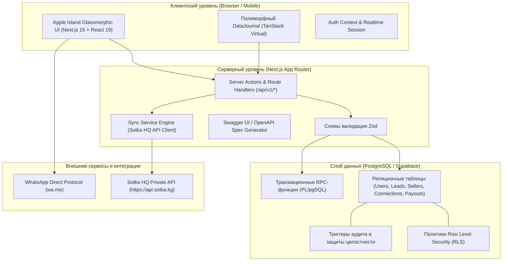
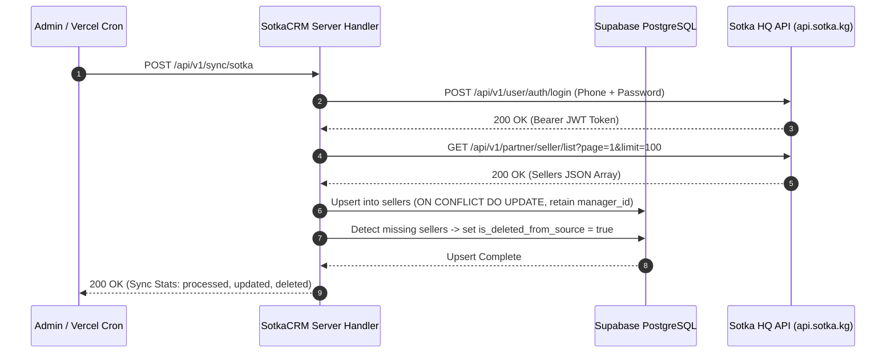
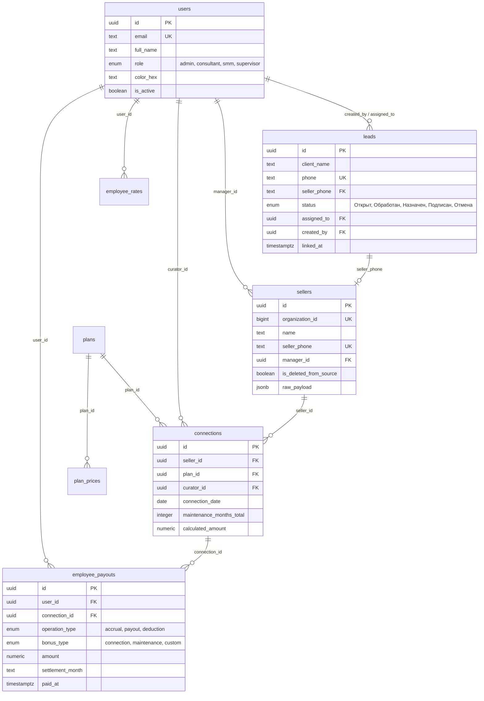

# SotkaCRM — Enterprise Merchant Acquisition & Commission Payroll Engine

[](https://nextjs.org/)
[](https://react.dev/)
[](https://www.typescriptlang.org/)
[](https://supabase.com/)
[](https://tailwindcss.com/)
[-green?logo=openapi-initiative)](http://localhost:3000/docs)

**SotkaCRM** — высокопроизводительная корпоративная CRM-платформа и биллинговый движок для управления жизненным циклом привлечения продавцов (мерчантов), контроля этапов модерации, биллинга подключений и автоматизированного начисления комиссионных вознаграждений сотрудникам в экосистеме сервиса **Sotka** (`https://api.sotka.kg`).

---

## Содержание

1. [Ключевые возможности](#1-ключевые-возможности)
2. [Архитектура системы](#2-архитектура-системы)
3. [Функциональные модули](#3-функциональные-модули)
   - [3.1. Воронка лидов (Leads Management)](#31-воронка-лидов-leads-management)
   - [3.2. Реестр продавцов (Sellers Registry)](#32-реестр-продавцов-sellers-registry)
   - [3.3. Подключения и Биллинг (Connections & Accruals)](#33-подключения-и-биллинг-connections--accruals)
   - [3.4. Операции по ЗП и Выплаты (Double-Entry Payroll)](#34-операции-по-зп-и-выплаты-double-entry-payroll)
   - [3.5. Тарифные планы и Ставки (Tariffs & Rates)](#35-тарифные-планы-и-ставки-tariffs--rates)
   - [3.6. Аналитика и Дашборды](#36-аналитика-и-дашборды)
   - [3.7. Интерактивная API Документация (OpenAPI 3.1 / Swagger UI)](#37-интерактивная-api-документация-openapi-31--swagger-ui)
4. [Ролевая модель доступа (RBAC & RLS)](#4-ролевая-модель-доступа-rbac--rls)
5. [Интеграция с внешним Sotka HQ API](#5-интеграция-с-внешним-sotka-hq-api)
6. [Структура базы данных и миграции](#6-структура-базы-данных-и-миграции)
7. [Дизайн-система (Apple Island Glassmorphism)](#7-дизайн-система-apple-island-glassmorphism)
8. [Переменные окружения](#8-переменные-окружения)
9. [Локальное развертывание и запуск](#9-локальное-развертывание-и-запуск)
10. [Скрипты валидации и тестирование](#10-скрипты-валидации-и-тестирование)
11. [Регламенты разработки и документация](#11-регламенты-разработки-и-документация)

---

## 1. Ключевые возможности

* **Асинхронная двухсторонняя синхронизация с Sotka HQ**: Загрузка продавцов, парсинг транзакций кошелька, отслеживание удалений в источнике (`is_deleted_from_source`).
* **Атомарное связывание «Лид ⇄ Продавец»**: Двусторонняя навигация, валидация свободных мерчантов, безопасная отвязка с возвратом лида в активную воронку через транзакционный PL/pgSQL RPC.
* **Гибкий биллинг комиссий**: Раздельные и пакетные режимы начислений («Только подключение», «Только сопровождение», «Все начисления»), динамический срок сопровождения мерчанта (от 0 до 12 месяцев), пакетное редактирование параметров.
* **Двойная бухгалтерская запись по зарплатам**: Строгий реестр `employee_payouts`, ведение баланса сотрудников, расчетных листов с дедупликацией начислений, учет авансов, удержаний и регулярных выплат.
* **Строгая изоляция данных (RLS)**: Разделение прав доступа на уровне строк PostgreSQL для ролей `admin`, `consultant`, `smm`.
* **Полиморфный реестр `DataJournal`**: Адаптивный интерфейс с поддержкой ПК-таблиц (виртуализация строк, кастомизация колонок, sticky-шапка) и мобильных карточек быстрого действия.
* **Zero-Emoji & Precision UI**: Чистый дизайн Apple Island (матовое стекло, эффект глубины, микроанимации, векторные иконки Lucide React с `stroke-width="1.75"`).

---

## 2. Архитектура системы

Платформа построена по сервисно-модульной архитектуре на базе Next.js App Router (Fullstack) и управляемого кластера PostgreSQL (Supabase):



---

## 3. Функциональные модули

### 3.1. Воронка лидов (Leads Management)

Управление входящими обращениями от потенциальных продавцов.

* **Жизненный цикл сделки (Воронка)**:
  $$\text{Открыт} \longrightarrow \text{Обработан} \longrightarrow \text{Назначен} \longrightarrow \text{Подписан} \quad \Big| \quad \text{Отмена}$$
* **Защита от случайного удаления**: Обычные пользователи не могут удалить лид — статус меняется на `Отмена`. Роль `admin` имеет право прямого Hard-Delete через специализированный RPC `admin_hard_delete_lead`.
* **Скрипты продаж**: Интерактивная панель `SalesScriptsModal` с готовыми скриптами квалификации, быстрым копированием в буфер обмена и тактильным виброоткликом `navigator.vibrate(50)`.
* **Быстрое связывание с мерчантом**: Выборка нераспределенных продавцов, поиск с использованием `pg_trgm`, атомарный переход лида в статус `Подписан`.
* **Двусторонний переход и отвязка**: Из карточки лида доступен прямой переход в профиль привязанного продавца, а администраторы могут отвязать мерчанта (`/api/v1/leads/[id]/unlink-seller`), вернув лид в статус `Обработан`.

### 3.2. Реестр продавцов (Sellers Registry)

Учет зарегистрированных организаций и торговых точек в системе Sotka.

* **Фоновая и ручная синхронизация**: Загрузка организаций из Sotka HQ с сохранением локально закрепленных менеджеров (`manager_id`).
* **Контроль удалений в источнике**: Если организация деактивирована или удалена в HQ, система маркирует запись флагом `is_deleted_from_source = true` и отображает бейдж **«Удален в HQ»**.
* **Транзакции мерчанта**: Вкладка истории транзакций кошелька мерчанта напрямую из Sotka HQ API (баланс, пополнения через банки, списания за тарифы).
* **Связка с лидом-источником**: Возможность перехода к исходному лиду и отвязки мерчанта (`/api/v1/sellers/[id]/unlink-lead`).

### 3.3. Подключения и Биллинг (Connections & Accruals)

Центральный процессинговый модуль биллинга подключенных продавцов.

* **Параметры договора**: Дата подключения, тарифный план (`Standard`, `Business`, `VIP`), дата завершения, куратор.
* **Настройка срока сопровождения**: Регулируемый период начисления бонусов куратору (`maintenance_months_total` от 0 до 12 месяцев).
* **Режимы запуска начислений**:
  1. `all` — Полный расчет: начисление разового бонуса за подключение и ежемесячного бонуса за сопровождение.
  2. `connection` — Начисление только бонуса за первичное подключение.
  3. `maintenance` — Начисление только бонуса за сопровождение в указанном расчетном месяце.
* **Пакетные операции**: Групповое изменение срока сопровождения для сотен подключений одновременно и пакетный запуск биллинга по выбранным записям.
* **Прозрачность финансового отображения**: При отсутствии фактической проводки в журнале ЗП отображается строго `0 сом`, исключая путаницу между виртуальным расчетом и выплаченным бонусом.

### 3.4. Операции по ЗП и Выплаты (Double-Entry Payroll)

Финансовый журнал начислений и выплат сотрудникам с балансовым учетом.

* **Двусторонняя модель проводок**:
  * **Начисления (`accrual`)**: Бонусы за подключение, бонусы за сопровождение, премии (+ к балансу сотрудника).
  * **Выплаты (`payout`)**: Регулярные выплаты, авансы (- из баланса сотрудника).
  * **Удержания (`deduction`)**: Корректировки, штрафные санкции (- из баланса сотрудника).
* **Расчетный лист сотрудника (Payroll Sheet)**: Детализированный отчет за выбранный расчетный период с агрегацией начисленных сумм по каждому мерчанту и автоматическим расчетом сальдо.
* **Методы расчетов**: Банковский перевод, электронные кошельки (Mbank, Optima, Demir, наличные).
* **Глобальный финансовый контроль**: Администратор имеет доступ ко всем выплатам организации, в то время как консультанты видят исключительно собственные финансовые операции.

### 3.5. Тарифные планы и Ставки (Tariffs & Rates)

* **Историчность цен тарифов (`plan_prices`)**: Хранение стоимости планов с фиксацией периода действия (`effective_from`). Ретроспективный расчет бонусов при изменении стоимости планов.
* **Индивидуальные ставки сотрудников (`employee_rates`)**: Персональные проценты за подключение и сопровождение с временными окнами действия.

### 3.6. Аналитика и Дашборды

* **Ключевые метрики (KPI)**: Количество активных лидов, конверсия воронки (Win Rate), объем привлеченной абонентской платы, фонд начисленной комиссии.
* **Графики динамики**: Помесячный тренд подключений, распределение по тарифным планам, рейтинг консультантов.
* **Экспорт данных**: Выгрузка отчетов в формате CSV для бухгалтерской отчетности.

### 3.7. Интерактивная API Документация (OpenAPI 3.1 / Swagger UI)

В систему встроен интерактивный Swagger UI по адресу `/docs`. Спецификация генерируется динамически скриптом `scripts/build-openapi.js` и охватывает 45 production-эндпоинтов с примерами запросов, схем валидации и ответов ошибок.

---

## 4. Ролевая модель доступа (RBAC & RLS)

Безопасность данных обеспечивается многоуровневыми политиками PostgreSQL Row Level Security (RLS) и серверными проверками прав пользователей.

| Модуль / Действие | SMM (`smm`) | Консультант (`consultant`) | Администратор (`admin`) |
| :--- | :---: | :---: | :---: |
| **Создание лидов** | Разрешено (FAB / Форма) | Разрешено | Разрешено |
| **Просмотр лидов** | Только созданные им (`created_by`) | Свои (`assigned_to`) + Нераспределенные | Все лиды компании |
| **Редактирование лида** | Разрешено (свои) | Разрешено (свои) | Разрешено |
| **Связывание с продавцом** | Запрещено | Разрешено | Разрешено |
| **Отвязка продавца / Hard Delete**| Запрещено | Запрещено | Разрешено |
| **Реестр продавцов** | Запрещено | Закрепленные за ним | Все продавцы компании |
| **Транзакции мерчанта HQ** | Запрещено | Просмотр закрепленных | Просмотр всех |
| **Синхронизация с Sotka HQ** | Запрещено | Запрещено | Инициация ручной и cron синхронизации |
| **Биллинг подключений** | Запрещено | Просмотр своих | Полный запуск, пакетные операции |
| **Журнал выплат (ЗП)** | Запрещено | Только личный расчетный лист | Полный сводный реестр компании |
| **Управление ставками и тарифами** | Запрещено | Запрещено | Создание, редактирование, архивация |

---

## 5. Интеграция с внешним Sotka HQ API

Интеграция реализована через серверный клиент `lib/api/sotka-client.ts`, гарантирующий защиту учетных данных администратора.



---

## 6. Структура базы данных и миграции

Схема базы данных построена на реляционной СУБД PostgreSQL и включает 22 последовательные миграции (`supabase/migrations/`):



### Реестр миграций

* `001_initial_schema.sql` — Базовые таблицы пользователей, лидов, продавцов, тарифов, RLS и триггеры.
* `002_auth_by_login.sql` — Расширение авторизации по логину/паролю и метаданным профиля.
* `003_security_and_integrity_fixes.sql` — Усиление внешних ключей и констрейнтов целостности.
* `004_add_biz_plan.sql` — Внедрение тарифного плана Business и ценовых категорий.
* `005_performance_rpcs_and_indexes.sql` — Высокопроизводительные RPC для расчета агрегатов дашборда.
* `006_strict_data_isolation.sql` — Изоляция выборки данных на уровне ролей SMM и консультантов.
* `007_funnel_and_directories_policy.sql` — Политики доступа к справочникам и этапам воронки.
* `008_employee_colors_and_rate_periods.sql` — Цветовые метки сотрудников и интервалы действия ставок.
* `009_performance_and_isolation_optimization.sql` — Оптимизация планов выполнения запросов с RLS.
* `010_consultant_permissions_and_indexes.sql` — Индексы для фильтрации нераспределенных сущностей.
* `011_sellers_organization_id_unique.sql` — Уникальный констрейнт `organization_id` для безопасного upsert.
* `012_perf_rls_cache_and_composite_indexes.sql` — Композитные B-Tree индексы под фильтры `DataJournal`.
* `013_consultant_seller_visibility.sql` — Доступ консультантов к карточкам привязанных мерчантов.
* `014_trgm_search_and_atomic_linking.sql` — Подключение расширения `pg_trgm`, атомарный RPC `link_lead_to_seller`.
* `015_maintenance_accruals_payroll_and_methods.sql` — Движок начисления сопровождения и расчетных листов.
* `016_payouts_isolation_smm_consultant.sql` — Защита финансовых проводок от несанкционированного чтения.
* `017_security_wallet_and_role_permissions.sql` — Проверка прав при операциях с балансом.
* `018_salary_operations_and_business_rules.sql` — Журнал зарплатных операций и учет удержаний.
* `019_fix_payroll_accruals_and_advance.sql` — Корректировка формул расчета авансов и сальдо.
* `020_hard_delete_leads_and_unified_accruals.sql` — RPC прямого удаления лидов для админа и унификация биллинга.
* `021_unified_accruals_modes_and_connection_cleanup.sql` — Мульти-режимные начисления (`all`, `connection`, `maintenance`).
* `022_cross_links_soft_delete_and_payouts_admin_fix.sql` — Двусторонняя отвязка «Лид ⇄ Продавец», флаг `is_deleted_from_source`, фиксация видимости выплат для Admin.

---

## 7. Дизайн-система (Apple Island Glassmorphism)

Интерфейс спроектирован по спецификации `UxUi.md` и ориентирован на мобильное и десктопное использование:

* **Матовое стекло (Glassmorphism)**:
  * Светлая тема: `backdrop-blur-xl bg-white/75 border border-white/20 shadow-sm`
  * Темная тема: `backdrop-blur-xl bg-zinc-900/75 border border-zinc-800/40 shadow-md`
* **Форм-фактор**: Скругления `rounded-2xl` и `rounded-3xl` для карточек, модальных окон и выпадающих списков.
* **Строгая типографика и векторная графика**: Использование контурных векторных иконок пакета **Lucide React**. В элементах интерфейса **полностью исключены emoji**.
* **Адаптивные интерфейсы**:
  * **Desktop (от 1024px)**: Боковой фиксированный сайдбар, верхний плавающий островок `TopHeader`, виртуализированная таблица с кастомизацией колонок.
  * **Mobile (до 1023px)**: Плавающий нижний бар навигации (`BottomNav`), плавающая кнопка быстрого добавления (`FAB 56x56px` под большой палец), карточный вид с быстрым набором звонка и переходом в WhatsApp.

---

## 8. Переменные окружения

Создайте файл `.env.local` в корне проекта на основе шаблона `.env.example`:

```env
# ==============================================================================
# Supabase Configuration
# ==============================================================================
NEXT_PUBLIC_SUPABASE_URL=https://your-project-id.supabase.co
NEXT_PUBLIC_SUPABASE_ANON_KEY=eyJhbGciOiJIUzI1NiIsInR5cCI6IkpXVCJ9...
SUPABASE_SERVICE_ROLE_KEY=eyJhbGciOiJIUzI1NiIsInR5cCI6IkpXVCJ9...

# ==============================================================================
# Sotka HQ API Integration Settings
# ==============================================================================
SOTKA_API_BASE_URL=https://api.sotka.kg
SOTKA_API_ISO_CODE_ID=1
SOTKA_API_PHONE=700888268
SOTKA_API_PASSWORD=your_secure_password_here

# ==============================================================================
# Application Environment & Scheduled Tasks
# ==============================================================================
NEXT_PUBLIC_APP_URL=http://localhost:3000
CRON_SECRET=your_cron_secret_token_here
```

> **Важно**: `SUPABASE_SERVICE_ROLE_KEY` и `SOTKA_API_PASSWORD` должны использоваться исключительно на сервере (Route Handlers, Server Actions) и никогда не попадать в клиентский бандл.

---

## 9. Локальное развертывание и запуск

### Требования
* Node.js 20.x или выше
* npm 10.x или pnpm
* Активный проект Supabase (облачный или локальный через Supabase CLI)

### Пошаговая инструкция

1. **Клонирование репозитория**:
   ```bash
   git clone https://github.com/kutya001/SotkaCRM.git
   cd SotkaCRM
   ```

2. **Установка зависимостей**:
   ```bash
   npm install
   ```

3. **Настройка переменных среды**:
   ```bash
   cp .env.example .env.local
   # Заполните валидные ключи в .env.local
   ```

4. **Применение миграций базы данных**:
   Выполните SQL-скрипты из папки `supabase/migrations/` в SQL Editor консоли Supabase по порядку (от `001_initial_schema.sql` до `022_cross_links_soft_delete_and_payouts_admin_fix.sql`).

5. **Генерация актуальной OpenAPI спецификации**:
   ```bash
   node scripts/build-openapi.js
   ```

6. **Запуск сервера разработки**:
   ```bash
   npm run dev
   ```
   Приложение доступно по адресу: `http://localhost:3000`.  
   Интерактивная API документация: `http://localhost:3000/docs`.

7. **Сборка для продакшена**:
   ```bash
   npm run build
   npm run start
   ```

---

## 10. Скрипты валидации и тестирование

В репозитории предусмотрен набор автоматизированных проверочных скриптов для валидации сквозных бизнес-сценариев:

| Скрипт | Назначение |
| :--- | :--- |
| `scripts/build-openapi.js` | Сканирует эндпоинты App Router и генерирует `public/openapi.json` |
| `scripts/verify-billing-payroll.mjs` | Тестирует расчет бонусов, дедупликацию и баланс ЗП |
| `scripts/verify-payouts-isolation.mjs` | Проверяет изоляцию данных реестра выплат по ролям RLS |
| `scripts/verify-wallet-bulk-isolation.mjs` | Валидирует пакетные операции с подключениями и кошельками |
| `scripts/verify-e2e.mjs` | Сквозной тест конверсии: «Создание лида → Связка → Подключение → Биллинг» |
| `scripts/verify-perf-swr.mjs` | Анализ задержек ответов API и кэширования |

Запуск любого проверочного скрипта выполняется командой:
```bash
node scripts/verify-billing-payroll.mjs
```

---

## 11. Регламенты разработки и документация

Архитектура проекта и регламенты поддержки синхронизированы в манифестах:

* **[`GEMINI.md`](./GEMINI.md)** — Главный координирующий регламент: архитектурные инварианты, правила управления памятью `.antigravity/` и стандарты разработки.
* **[`ТЗ.md`](./ТЗ.md)** — Техническое задание: цели, спецификации бизнес-процессов, сценарии конверсии и этапы сдачи.
* **[`DB.md`](./DB.md)** — Физическая спецификация СУБД: DDL-структуры, триггеры, индексы, RPC и политики RLS.
* **[`UxUi.md`](./UxUi.md)** — Руководство по стилю Apple Island, токенам, компонентам реестра и мобильным экранам.
* **[`sotka-api.json`](./sotka-api.json)** — Контракты взаимодействия с внешним API `https://api.sotka.kg`.

---

## Лицензия

Проект разработан для внутреннего использования в рамках экосистемы **Sotka**. Все права защищены.
